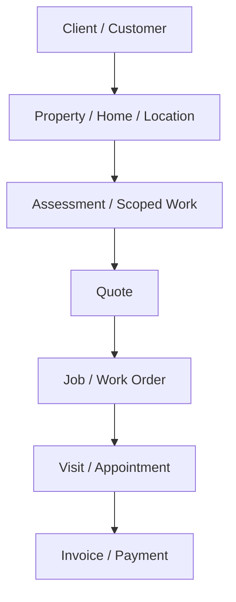
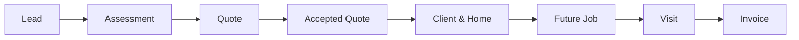
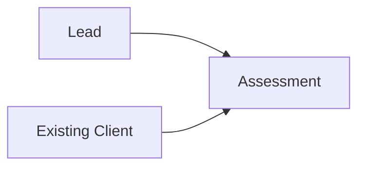
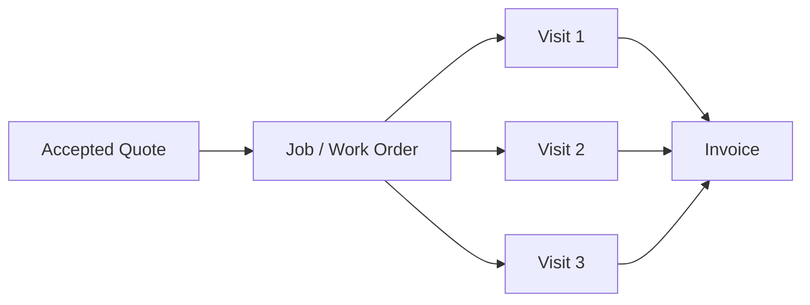
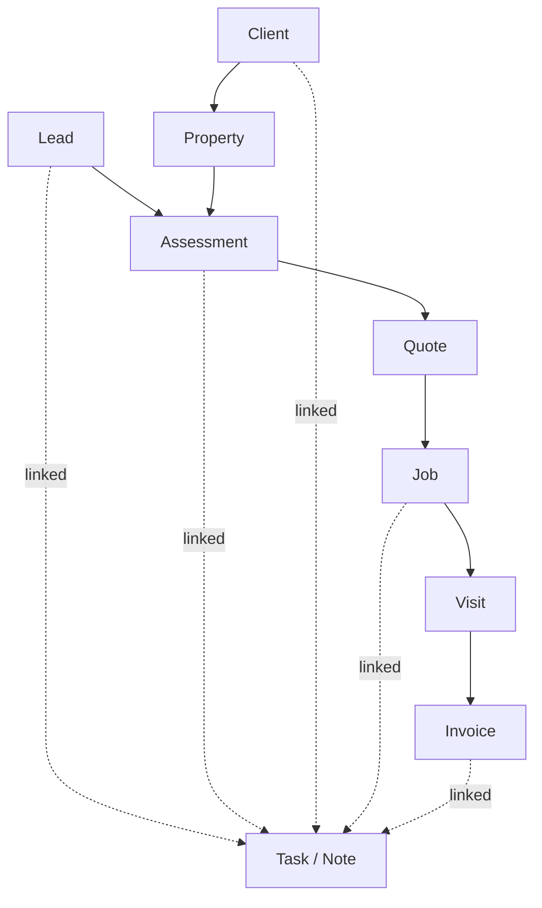

# PandaZen System Architecture Deck

---

## Slide 1 - Title

# PandaZen System Architecture

**Current state + target state**

Boutique cleaning operations system for sales, scoped work, quoting, delivery, and later billing.

---

## Slide 2 - What problem PandaZen solves

- Boutique cleaning businesses need one calm operational system
- Sales work and delivery work should connect, but not blur together
- PandaZen should support:
  - enquiries
  - scoped work
  - quotes
  - accepted client/property records
  - future delivery
  - future billing
- Goal: lean working software, not enterprise bloat

```text
PandaZen = trust-led cleaning operations
not a generic heavy CRM
not a demo dashboard
```

---

## Slide 3 - Core hierarchy



**Rule**
- Client is the top relationship object
- Property sits below Client

---

## Slide 4 - End-to-end workflow



**Current app note**
- The app still uses a temporary accepted Assessment/Quote -> Client & Home bridge
- The full Job / Work Order layer is not built yet

---

## Slide 5 - Core objects overview

| Object | Main purpose | Current state |
|---|---|---|
| Lead | Raw enquiry and early triage | Built |
| Client | Relationship / payer / main contact | Built in combined Client & Home form |
| Property | Where work happens | Partly represented inside Client & Home |
| Assessment | Internal scoped-work record | Built |
| Quote | Commercial offer | Built |
| Job | Delivery container | Planned |
| Visit | Scheduled occurrence | Planned |
| Invoice | Payment request | Planned |
| Task | Operational reminder | Built |
| Note | Human context/history | Built |

---

## Slide 6 - Lead module

**Purpose**
- Capture and triage new enquiries

**Lean statuses**
- new
- contacted
- waiting_customer
- assessment_needed
- closed_converted
- closed_not_suitable
- closed_lost
- closed_no_response

**Owns**
- contact details
- rough service request
- early qualification
- Quote Assist context

**Flows next**

```text
Lead -> Assessment
or
Lead -> closed / lost / not suitable
```

---

## Slide 7 - Assessment module

**Purpose**
- Internal scoped-work record
- Not the commercial quote
- Not the future job

**Two creation paths**
- New enquiry:
  - Lead -> Assessment
- Existing client extra work:
  - Client & Home -> new Assessment under same Client

**Global vs local**
- Global Assessments queue = active work to scope/price/review
- Client & Home -> Assessments = linked client work history and active scoped work



---

## Slide 8 - Quote module

**Purpose**
- Commercial offer linked to one Assessment

**Statuses**
- draft
- sent
- accepted
- rejected
- expired
- void
- superseded

**Versioning**
- `Q-00023/01`
- `Q-00023/02`
- `Q-00023/03`

**Important rule**
- Quote is the commercial promise
- Assessment is the internal scoped-work record
- Quote is not the delivery record

---

## Slide 9 - Client & Home module

**What it means**
- Client = relationship / payer / main contact
- Home / Property = where work happens

**Should show**
- customer identity
- property context
- linked assessments
- linked quotes
- future jobs / visits
- future invoices

**Important**
- one client may have multiple properties
- one client may have multiple assessments/jobs
- Client & Home headers should not imply only one service/frequency

```text
Client & Home = operational hub
not the hidden sales queue
```

---

## Slide 10 - Future Job / Visit / Invoice model



**Supports**
- recurring cleaning
- one-off extra work
- batched invoicing across multiple visits later

**Key distinction**
- Job = delivery container
- Visit = one scheduled occurrence
- Invoice = payment request, potentially grouped

---

## Slide 11 - Global views vs client-local views

| View type | Should appear globally | Should appear inside Client & Home |
|---|---|---|
| Leads | yes | no, except linked history if needed |
| Assessments | yes, as work queue | yes, as linked client work |
| Quotes | yes, as commercial queue | yes, as linked quote history |
| Jobs | yes, as operational queue | yes, as linked delivery history |
| Visits | yes, in schedule | yes, under linked jobs |
| Invoices | yes, in accounting queue | yes, as client billing history |
| Tasks | yes, due/work queue | yes, when linked to client/property/work |

**Do not duplicate**
- the same object as a shadow copy
- separate hidden client-only versions of Assessments or Quotes

---

## Slide 12 - Data flow map



**Ownership rules**
- Lead may create first Assessment
- Existing-client Assessment links by `client_id`
- Existing-client Assessment uses `lead_id = NULL`
- Accepted Quote should eventually create Job

---

## Slide 13 - Status model

| Object | Lean statuses |
|---|---|
| Lead | new, contacted, waiting_customer, assessment_needed, closed_converted, closed_not_suitable, closed_lost, closed_no_response |
| Assessment | draft, in_progress, review_needed, ready_to_quote, quote_created, quote_sent, waiting_customer, converted, not_proceeding |
| Quote | draft, sent, accepted, rejected, expired, void, superseded |
| Client | active, inactive, archived |
| Job | draft, scheduled, in_progress, completed, cancelled |
| Visit | scheduled, in_progress, completed, no_access, cancelled, rescheduled |
| Invoice | draft, issued, part_paid, paid, overdue, void |

---

## Slide 14 - Naming / display rules

- Customer/client name first
- Property/address second
- Service/purpose in service column
- No `work_label` as normal workflow identity
- Do not duplicate address strings
- Client & Home header must not imply only one service/frequency
- Use structured display identity:
  - client
  - property
  - service
  - purpose
  - status
  - quote reference

**Bad**
```text
One-off - Follow-up - Client: Claire Wood
```

**Better**
```text
Claire Wood
5 Garden Lane
One-off cleaning | Existing client extra work | Draft | Q-00021/01
```

---

## Slide 15 - Data discipline rules

**Keep fields that help us**
- contact the client
- identify the property
- estimate time/price
- plan access/logistics
- help a cleaner do the job
- create quote/job/invoice
- track status/history

**Avoid**
- vanity labels
- duplicate summary fields
- optional junk data
- free text where dropdowns are better

```text
If a field does not help contact, identify, price,
plan, deliver, invoice, or track history,
it probably does not belong yet.
```

---

## Slide 16 - Current implementation state

**Done**
- Leads MVP
- Assessments workspace
- Quote Assist
- Quote Builder
- Quote editor / preview
- Client & Home workspace
- extra assessment flow for existing client
- editable workspace areas

**In progress / rough edges**
- assessment wizard polish
- display consistency
- naming consistency
- client-local vs global surfacing

**Not built yet**
- full Job / Work Order layer
- Visit scheduling model
- Invoice / billable-events model
- payments

---

## Slide 17 - Outstanding architecture questions

- When should accepted Quote create Job versus just link to Client & Home?
- How soon should Property become a more explicit first-class object in storage and UI?
- Where should recurring cleaning plan sit between Quote and Job?
- When should Job and Visit become visibly separate modules?
- What is the minimum billable-event model needed before invoicing?
- Which Assessment fields are truly operationally essential versus just nice to have?

---

## Slide 18 - Recommended next build order

1. finish assessment/current branch polish
2. stabilise naming/display consistency
3. define Job / Work Order architecture
4. define Visit model
5. define invoice / billable-events model

**Suggested principle**

```text
Finish object boundaries before adding more workflow layers.
```

---

## Appendix - Light wireframe

```text
GLOBAL ASSESSMENTS

+--------------------------------------------------------------+
| Claire Wood                                                  |
| 5 Garden Lane                                                |
| One-off cleaning | Existing client extra work | Draft        |
| Quote: Q-00021/01                                            |
+--------------------------------------------------------------+

CLIENT & HOME -> ASSESSMENTS

+--------------------------------------------------------------+
| Linked Assessments                                           |
| - One-off cleaning | 5 Garden Lane | Draft | Q-00021/01      |
| - Deep clean       | 9 New Street  | Accepted | Q-00018/02   |
+--------------------------------------------------------------+
```
